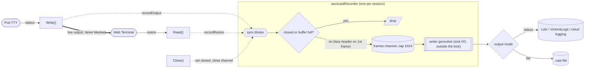

# Proposal: Terminal Session Recording for Exec Shells

When someone opens a shell into a pod from the Argo CD UI, record what shows up on screen so the session can be audited and replayed later. Recording never slows down the live terminal, and only container `stdout` is captured, never `stdin`.

**Related**: [#9918](https://github.com/argoproj/argo-cd/issues/9918), "Web Shell - Terminal log for auditing purposes"

**POC Code**: [master...n888:argo-cd:terminal-session-recording](https://github.com/argoproj/argo-cd/compare/master...n888:argo-cd:terminal-session-recording)

**POC Instructions**: [#9918 (comment)](https://github.com/argoproj/argo-cd/issues/9918#issuecomment-4785185938)

## Problem

ArgoCD/Kubernetes audit logs record that someone opened a shell in a pod, but not what they ran once inside a shell.

## Design

Every UI exec session is recorded in Asciicast v2, the asciinema format: a timestamped text log of the terminal screen that replays in any standard player.

The design follows two rules:

1. Recording never slows the terminal. Recording I/O happens off the hot path. If the recorder can't keep up, frames are dropped and counted, and the shell stays responsive.
2. Keystrokes are never recorded. Only container `stdout` is captured, never `stdin`. This mitigates the chance of recording secrets but doesn't eliminate it: non-echoed input like `sudo` or database password prompts never appears, but anything echoed to the screen (a password typed into a visible command line, a `cat` of a secret file) is output and will be recorded.

## How it works

The recorder hooks `terminalSession.Write` in `server/application/websocket.go`, which all pod output passes through on its way to the browser. Resize events are picked up in the `Read` loop. Everything runs inside `argocd-server`.

The solid path is the live terminal: pod output is forwarded to the browser synchronously and never waits on recording. On the dashed path, `Write()` and `Read()` marshal an Asciicast frame on the calling goroutine, keeping timestamps accurate, then attempt a non-blocking enqueue. A session-scoped mutex, held only for an instant, makes the enqueue sequence atomic: the header is emitted exactly once and always first, frames enqueue in timestamp order, and a send on a closed channel can't happen during shutdown. The slow work of writing to disk or the log stream runs in a separate writer goroutine. On teardown, `Close()` flushes buffered frames, bounded by a 5-second timeout so a hung sink can't block session cleanup.

- The Asciicast header (initial dimensions and start timestamp) is emitted lazily on the first event, falling back to 80x24 until the first resize. `"o"` frames carry output, `"r"` frames carry resizes so replay matches the viewport.
- The frame channel is bounded at 1024 per session. When it fills (say, a slow NFS sink), frames are dropped and counted rather than blocking, trading recording completeness for terminal responsiveness. Drops are logged (a warning on the first, the total at session end), so an incomplete recording is always detectable.

## Security

- `stdin` is excluded, so non-echoed secrets (password prompts) never reach the recording. Secrets echoed to the screen are still captured, so treat recordings as sensitive.
- `.cast` files are created with `0600` permissions, readable only by the `argocd-server` process owner.
- Recording configuration stays server-side. `/api/v1/settings` exposes only the boolean `terminalSessionRecordingEnabled`, and only to logged-in users.
- Filenames (`<app>-<user>-<pod>-<container>-<timestamp>.cast`) are sanitized as a whole (`:` and `/` become `_`), so no component (app RBAC name, IdP username) can inject a path separator and escape the recording directory. For example, app `default/guestbook`, user `alice@example.com`, container `main` in pod `guestbook-ui-7d9f8` produces `default_guestbook-alice@example.com-guestbook-ui-7d9f8-main-20260622-210654.123.cast`.

## Configuration (`argocd-cm`)

| Key | Default | Description |
| --- | --- | --- |
| `terminal.session.recording.enabled` | `false` | Enables or disables terminal recording. |
| `terminal.session.recording.output` | `stdout` | Output destination: `stdout` or `file`. |
| `terminal.session.recording.path` | `""` | Directory for `.cast` files in `file` mode. Supports Go template date tokens. |

`path` is a Go template rendered at session start with zero-padded UTC date fields: `/recordings/{{.Year}}/{{.Month}}/{{.Day}}` puts a session started 2026-07-14 23:30 UTC in `/recordings/2026/07/14/`. The rendered path must be absolute; missing directories are created automatically (`0700`).

Configuration is validated at load: an invalid `output`, or `file` mode with an empty, non-parsing, or non-absolute `path`, disables recording with a warning. A failed file open disables recording for that session only; the session always proceeds.

## Operational notes

- `file` mode has no automatic pruning. Date-templated paths make retention as simple as deleting expired date directories.
- Recordings land on whichever `argocd-server` replica serves the session. For centralized access, use a ReadWriteMany volume, or `stdout` mode: every frame is logged with `terminal_session_app`, `terminal_session_user`, `terminal_session_pod`, and `terminal_session_container` fields for querying in logging systems.
- Filenames can collide in the rare case that two sessions with the same app, user, pod, and container start in the same millisecond; `O_APPEND` would then interleave both recordings.

## Potential extra/future features

- A "this session is being recorded" notice in the terminal UI; the auth-gated `terminalSessionRecordingEnabled` API flag already exists for it.
- Built-in retention or rotation for `file` mode.

## Impact

Off by default. Disabled, the cost is one nil check per write; enabled, timestamping and JSON marshalling. Recordings play in any standard Asciicast v2 player.
