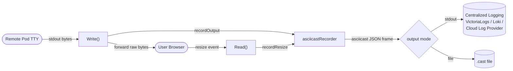
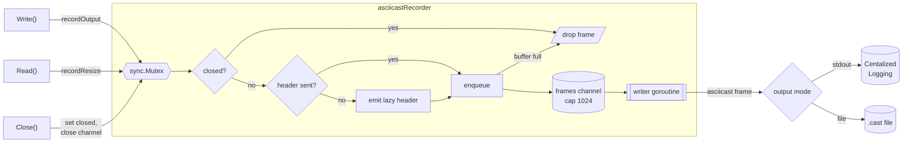

# Proposal: Terminal Session Recording for Exec Shells

## Overview
This proposal describes the implementation of terminal session recording for interactive `exec` sessions launched via the Argo CD UI. Sessions are recorded in the **Asciicast v2** format to enable auditing of operator actions and forensic replay of terminal sessions.

## Motivation
While Kubernetes audit logs record the request to execute a command in a pod, they do not capture the TTY stream. This leaves a gap in visibility regarding the actual operations performed during an interactive session, which is critical for security auditing and troubleshooting.

## Design

### Implementation
The recording logic hooks into `terminalSession.Write` in `server/application/websocket.go`, which is the central point for all pod output directed to the browser. Terminal resize events are captured within the `Read` loop.

A dedicated `asciicastRecorder` transforms the raw stream into Asciicast v2 frames:
- **Header:** Contains initial terminal dimensions and the start timestamp; emitted lazily on the first event.
- **Output (`"o"`):** Timestamped blocks of terminal output.
- **Resize (`"r"`):** Terminal resize events to ensure replay matches the original viewport.

The recorder is asynchronous. `Write` and `Read` only marshal a frame and hand it to a bounded channel; a separate writer goroutine performs the sink I/O. The terminal therefore never blocks on a slow or hung sink: when the channel is full, frames are dropped and counted rather than queued. If the writer cannot keep up, the recording loses frames but the session stays responsive.

### Data Flow

The diagram below adds the locking. `Write()`, `Read()`, and `Close()` share one `sync.Mutex`. Under the lock the recorder checks `closed`, emits the lazy header, and does a non-blocking enqueue onto the channel. Because producers check `closed` under the same lock `Close()` uses to close the channel, there is no send-on-closed-channel panic. The sink I/O runs in the writer goroutine, outside the lock.

### Concurrency and Performance
To prevent recording I/O from impacting terminal responsiveness, each session utilizes an isolated recorder and a background writer goroutine. 

`recordOutput` and `recordResize` marshal frames on the calling goroutine to maintain timestamp accuracy and enqueue them via a bounded channel. The background writer performs the actual sink I/O. If the buffer fills (e.g., due to a slow NFS/EFS volume), frames are dropped rather than blocking the interactive shell. This prioritizes terminal responsiveness over recording completeness; dropped frames are logged to indicate the recording is incomplete.

A session-scoped `sync.Mutex` serializes the lazy header emission and enqueueing between the TTY output pump and the WebSocket resize reader. On session teardown, `Close()` flushes buffered frames and closes the sink within a defined timeout to prevent hung sinks from blocking cleanup.

### Security and Privacy
- **Input Exclusion:** Only `stdout` is recorded. `stdin` is omitted to ensure that non-echoed secrets (e.g., passwords for `sudo` or databases) are not captured. Echoed commands remain visible in the output stream.
- **Path Sanitization:** In `file` mode the filename is `<app>-<user>-<pod>-<container>-<timestamp>.cast`. The whole filename is sanitized — `:` and `/` are replaced with `_` — before it is joined to the recording directory, so no component (e.g. the application RBAC name or the IdP-supplied username) can introduce a path separator and escape the configured directory. For example, application `default/guestbook` accessed by `alice@example.com` in container `main` of pod `guestbook-ui-7d9f8` produces `default_guestbook-alice@example.com-guestbook-ui-7d9f8-main-20260622-210654.123.cast`.

### Deployment Considerations
- **Storage Management:** File output does not include automatic pruning; disk space must be managed externally.
- **Distributed Architecture:** Since sessions are distributed across `argocd-server` replicas, local file recordings will be scattered. For centralized access, use a ReadWriteMany volume or the `stdout` logging mode.

## Configuration (`argocd-cm`)

| Key | Default | Description |
| --- | --- | --- |
| `terminal.session.recording.enabled` | `false` | Enables or disables terminal recording. |
| `terminal.session.recording.output` | `stdout` | Output destination: `stdout` or `file`. |
| `terminal.session.recording.path` | `""` | Directory for `.cast` files when using `file` mode. |

## Impact
The implementation introduces minimal CPU overhead (timestamping and JSON marshalling) and maintains compatibility with any standard Asciicast v2 player.
